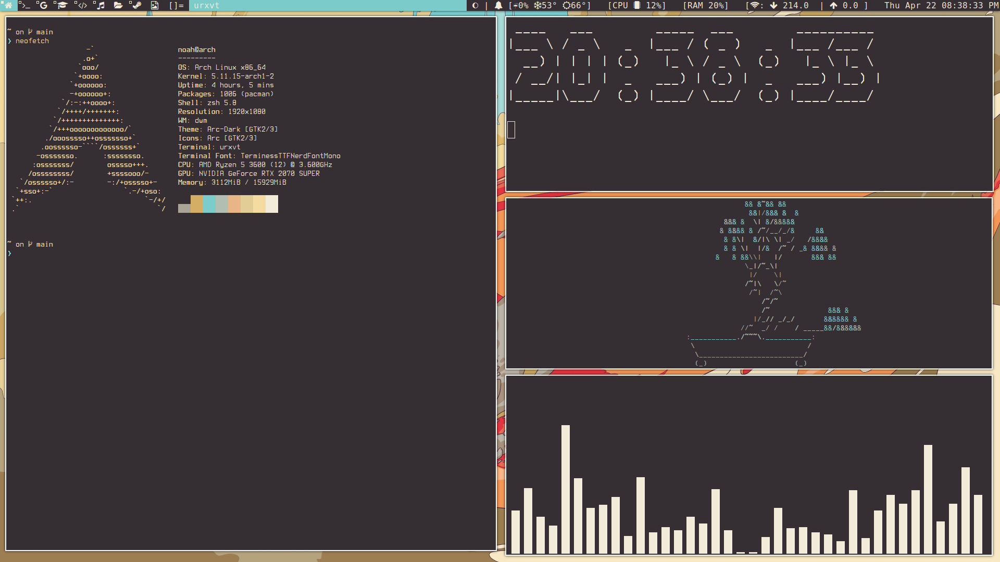

# dwm-dot-files My personal configs installed needed apps:

<h3>My Dot Files and how to use them:</h2>
These are my personal arch config files, they are a bit messy but they are good for me and my workflow, these configs use PyWal so you can easily change wall pappers and get a good looking theme to, it also uses dwm, dmenu, slstatus, and some other suckless software. if you install all the dependencies for my dot files then you should be able to compile choose a wal papper by wal -i <walpapper.whereYouHaveIt>, and then if you have my scripts set up you can either do a "sudo compileSuckless" command or go the the doc-files directory and go to scripts and do "./compileSuckless". Do that and get the other dependencies and you should be up and running. If you have and problems or if you have suggestions which i galdly will take, because i am still pretty new to this, contact me at noahfrmc@gmail.com.

<h3>My personal configs installed needed apps:</h3>
youtube-dl zathura zsh w3m webkit2gtk wireless_tools wpa_supplicant alsa-utils zip vlc unclutter unzip ttf-font-awesome sxiv ranger python-pip python3 pulseaudio pulseaudio-bluetooth pulseaudio-equalizer pulseaudio-jack zathura-pdf-poppler picom os-prober pciutils nitrogen networkmanager network-manager-applet neofetch mpv minizip m4 htop highlight gzip gvim gtk2 gtk3 gparted gnome-keyring exa lsd bat dunst doge clipit cmatrix bluez-utils bluez awesome-terminal-fonts alsa-utils lsof imagemagick lxappearance qt5ct arc-gtk-theme arc-icon-theme

<h4>Configs depenendent github repos:</h4>

https://github.com/TheArk99/surf

https://github.com/TheArk99/dwm

https://github.com/TheArk99/Doc-files -This is some of my personal scripts and random Doc files of mine

https://github.com/TheArk99/slstatus

https://github.com/TheArk99/st

https://github.com/TheArk99/fonts

https://github.com/TheArk99/dmenu

https://github.com/TheArk99/wallpapers

https://github.com/TheArk99/URxvt-perl-extensions.git

<h5>Sites to install other programs i like to have:</h5>

https://linuxhint.com/install_steam_arch_linux/

https://www.youtube.com/watch?v=k7H5ijABbLw

https://github.com/karlstav/cava#installing

https://github.com/orf/gping

https://github.com/karlstav/cava

https://aur.archlinux.org/packages/edex-ui

https://github.com/Bugswriter/tuxi

https://www.sublimetext.com/docs/3/linux_repositories.html

https://code.visualstudio.com/docs/setup/linux#_installation

https://starship.rs/

https://github.com/b-ryan/powerline-shell
